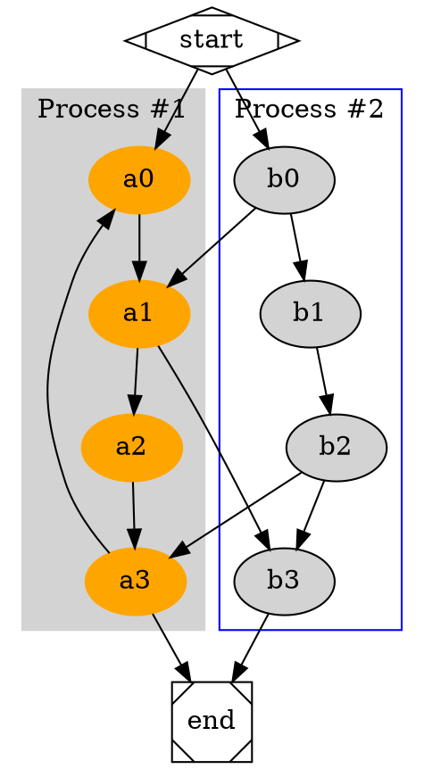

Recently I've come to know a fairly unique piece of software called GraphViz. Its short for Graph Visualization Software and according to the page on Wikipeida it was initialy released back in 1991. What caught my attention in particular about GraphViz is the succient way it allows you to produce elaborate graphs by scripting lines of the DOT language. You can then use a small assortment of readily made graphing tools to transform your DOT files into full images. All of this got me thinking... why did I put up with overly complex GUI tools with bells and whistles when a rather basic DOT file can accomplish the same task?

<!-- more -->

## Everthing Old Is New

 I admit between all of the folks talking about how "Makefiles" are the new automation tool of choice and what I dub the "text editor renaissance" which has been brought on by the likes of Sublime, Atom and Visual Studio Code as opposed to the early 2000s when IDEs were all the rage its great to see a return to fundamental tools that are programmable/quick n dirty and highly customizable. Anyhow, back to the main topic; GraphViz in addition to being able to turn lines of DOT into pretty graphs as shown in the "example" also has several language bindings.

## DOT Is Easy To Pick Up
A modified version of "Cluster" [http://graphviz.org/Gallery/directed/cluster.html](http://graphviz.org/Gallery/directed/cluster.html)




## GraphViz Includes A C Library

I was browsing the GraphViz website in search of documentation regarding language bindings for C/C++ when I discovered that I already had the necessary libraries installed on my machine when I first downloaded `brew install graphviz`.

To make things short I wanted to see if I could compile and run the `simple.c` file mentioned in the official docs.

```c
/* simple.c */

#include<graphviz/gvc.h>

int main(int argc, char **argv)
{
  GVC_t *gvc;
  Agraph_t *g;
  FILE *fp;
  gvc = gvContext();
  if (argc > 1)
    fp = fopen(argv[1], "r");
  else
    fp = stdin;
  g = agread(fp, 0);
  gvLayout(gvc, g, "dot");
  gvRender(gvc, g, "plain", stdout);
  gvFreeLayout(gvc, g);
  agclose(g);
  return (gvFreeContext(gvc));
}
```

On MacOS you can compile with the following command...

```sh
gcc -I /usr/local/Cellar/graphviz/2.40.1/include simple.c -L/usr/local/Cellar/graphviz/2.40.1/lib -lgvc -lcgraph -lcdt
```

With that completed we can pass a dot file as an input and get a `plain` formatted output.

```sh
./a.out clusters.dot 
```

The output...

```
graph 1 3 5.5307
node a0 0.875 4.253 0.75 0.5 a0 filled ellipse orange orange
node a1 0.875 3.253 0.75 0.5 a1 filled ellipse orange orange
node a2 0.875 2.253 0.75 0.5 a2 filled ellipse orange orange
node a3 0.875 1.253 0.75 0.5 a3 filled ellipse orange orange
node b0 2.3194 4.253 0.75 0.5 b0 filled ellipse black lightgrey
node b1 2.3611 3.253 0.75 0.5 b1 filled ellipse black lightgrey
node b2 2.4028 2.253 0.75 0.5 b2 filled ellipse black lightgrey
node b3 2.3194 1.253 0.75 0.5 b3 filled ellipse black lightgrey
node start 1.5972 5.2807 0.99515 0.5 start solid Mdiamond black lightgrey
node end 1.5972 0.25149 0.50297 0.50297 end solid Msquare black lightgrey
edge a0 a1 4 0.875 4.0006 0.875 3.8937 0.875 3.7665 0.875 3.6476 solid black
edge a1 a2 4 0.875 3.0006 0.875 2.8937 0.875 2.7665 0.875 2.6476 solid black
edge a1 b3 4 1.0379 3.0274 1.2904 2.6778 1.7779 2.0028 2.0734 1.5936 solid black
edge a2 a3 4 0.875 2.0006 0.875 1.8937 0.875 1.7665 0.875 1.6476 solid black
edge a3 a0 10 0.67885 1.4712 0.56592 1.612 0.43486 1.8053 0.375 2.003 0.18181 2.641 0.18181 2.8649 0.375 3.503 0.42036 3.6528 0.50662 3.8 0.59488 3.9239 solid black
edge a3 end 4 1.0389 1.0257 1.1252 0.90609 1.2331 0.75643 1.331 0.62066 solid black
edge b0 a1 4 2.0545 4.0696 1.8305 3.9145 1.5069 3.6904 1.2552 3.5162 solid black
edge b0 b1 4 2.33 4.0006 2.3344 3.8937 2.3397 3.7665 2.3447 3.6476 solid black
edge b1 b2 4 2.3716 3.0006 2.3761 2.8937 2.3814 2.7665 2.3863 2.6476 solid black
edge b2 a3 4 2.1332 2.0765 1.8925 1.919 1.5371 1.6863 1.2653 1.5085 solid black
edge b2 b3 4 2.3817 2.0006 2.3728 1.8937 2.3622 1.7665 2.3523 1.6476 solid black
edge b3 end 4 2.1556 1.0257 2.0693 0.90609 1.9614 0.75643 1.8635 0.62066 solid black
edge start a0 4 1.4648 5.0922 1.3671 4.9533 1.2316 4.7604 1.115 4.5946 solid black
edge start b0 4 1.7297 5.0922 1.8273 4.9533 1.9629 4.7604 2.0794 4.5946 solid black
stop

Thats about it for now.
```
